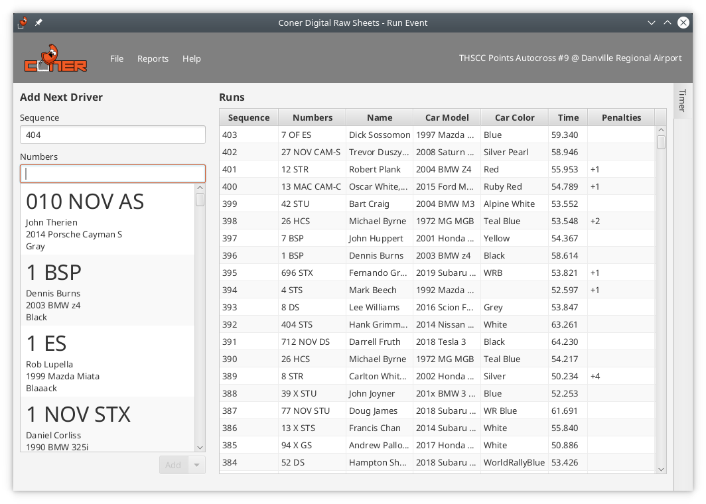

# Coner Digital Raw Sheets

Digital Raw Sheets is an app replacement for paper raw sheets. It reduces the drag of working raw sheets by acquiring times automatically and making it push-button simple to key in drivers and penalties.



## Run

This project uses Maven for build automation, and includes a Maven wrapper for convenience.

### Build 
Requirements:
- JDK 8 with JavaFX (suggestion: [Zulu](https://www.azul.com/downloads/zulu-community/?&version=java-8-lts&package=jdk-fx))

Execute build:
```shell script
./mvnw clean package -DskipTests=true
```

### Start
Launch app:
```shell script
java -jar target/drs-*.jar
```
